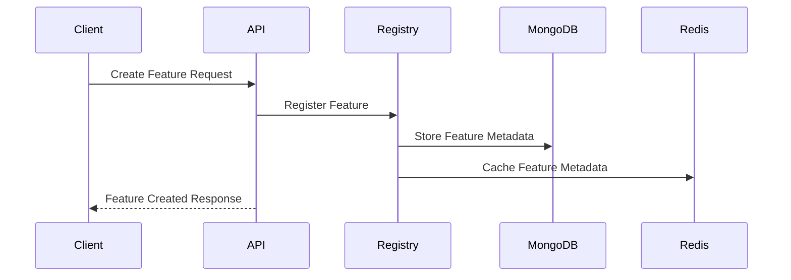
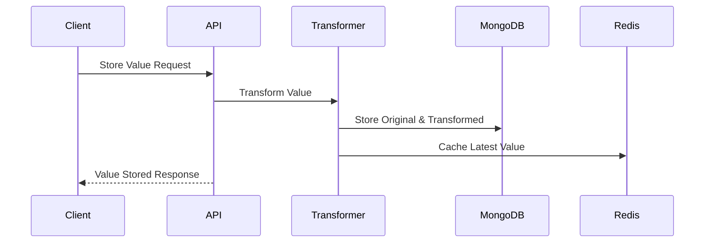
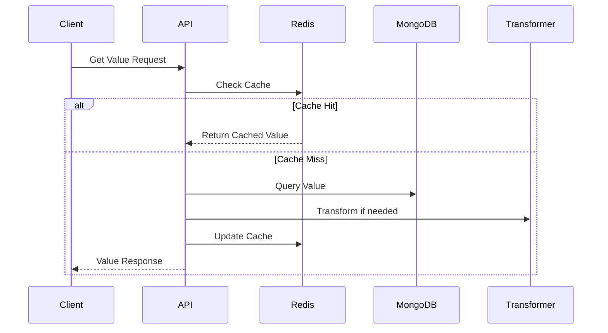
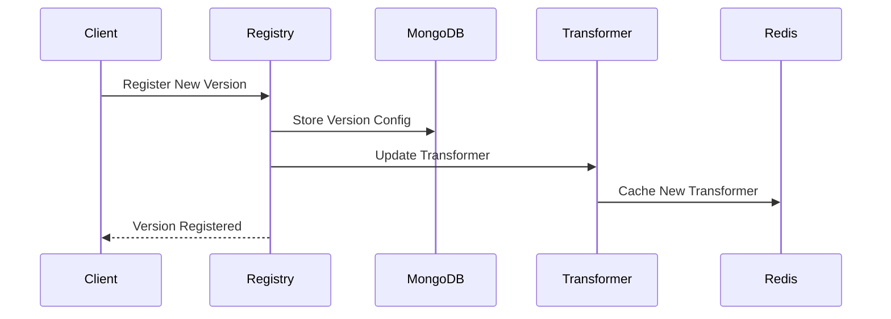
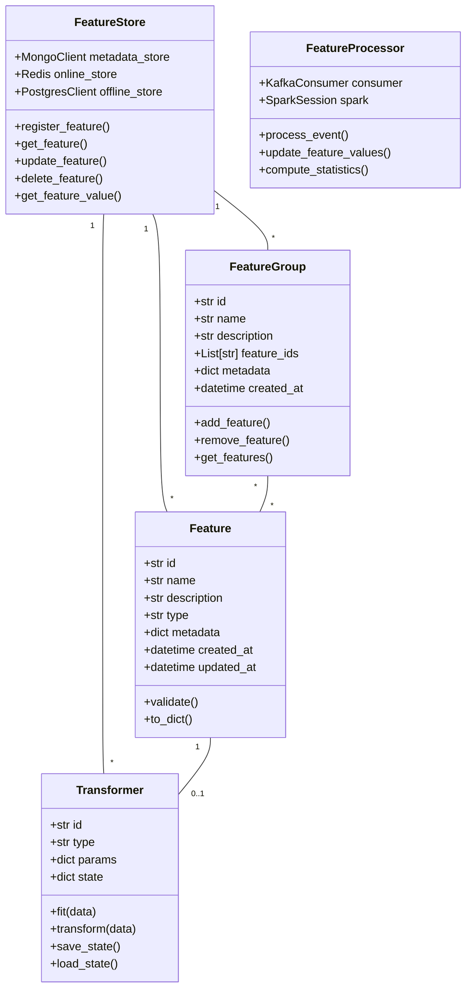
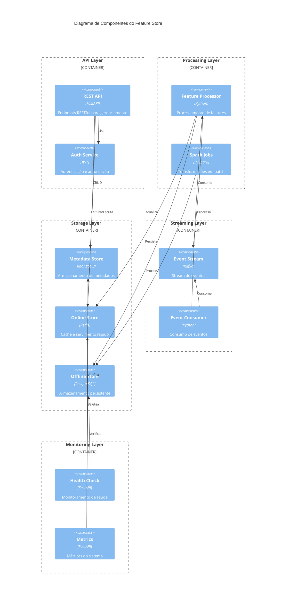

# FStore Architecture

## Overview

FStore é uma feature store moderna e escalável que suporta transformação, armazenamento e servimento de features para machine learning. A arquitetura é construída em torno dos princípios de confiabilidade, escalabilidade e facilidade de uso.

## System Components

### 1. Storage Layer

#### Online Store (Redis)
- Servimento rápido de features para inferência em tempo real
- Cache de valores de features
- Cache de transformadores treinados
- Formatos de chave:
  - `feature:{feature_id}`
  - `feature_value:{feature_id}:{entity_id}`
  - `transformer:{feature_id}:{version}`

#### Offline Store (PostgreSQL)
- Armazenamento persistente de features processadas
- Suporte a consultas SQL complexas
- Histórico de valores de features
- Integração com ferramentas de análise

#### Metadata Store (MongoDB)
- Armazenamento de metadados e configurações
- Versionamento de features e transformadores
- Collections:
  - `features`: Definições de features
  - `feature_groups`: Definições de grupos
  - `feature_versions`: Versionamento e configurações
  - `transformers`: Configurações de transformadores

### 2. Feature Registry

O Feature Registry gerencia o ciclo de vida das features:
- Registro de novas features
- Versionamento de features e transformadores
- Rastreamento de dependências
- Histórico de mudanças
- Metadados e configurações

### 3. Processing Layer

#### Apache Spark
- Processamento distribuído de features
- Transformações em batch e streaming
- Integração com Kafka para consumo de eventos
- Conexão JDBC com PostgreSQL para persistência

Características principais:
- Processamento escalável
- Transformações SQL
- Agregações em tempo real
- Integração com fontes de dados diversas

#### Feature Processor
- Consumo de eventos do Kafka
- Processamento com Spark
- Persistência no PostgreSQL
- Monitoramento e logging

### 4. Transformation Layer

#### Transformadores Numéricos
- StandardScaler
- MinMaxScaler
- Configuração flexível
- Persistência de estado

#### Transformadores Categóricos
- LabelEncoder
- OneHotEncoder
- Mapeamentos customizáveis
- Suporte a categorias desconhecidas

### 5. API Layer (FastAPI)

A camada de API fornece endpoints RESTful para:
- Gerenciamento de features (CRUD)
- Armazenamento e recuperação de valores
- Gerenciamento de grupos
- Registro e versionamento
- Transformação de dados
- Monitoramento

Características principais:
- Async/await para I/O eficiente
- Validação com Pydantic
- Documentação OpenAPI
- Tratamento de erros e logging

### 6. CLI Layer

Interface de linha de comando para:
- Gerenciamento de features
- Operações em lote
- Consultas ad-hoc
- Administração do sistema

## Data Flow

### 1. Feature Creation and Registration


### 2. Feature Transformation and Storage


### 3. Feature Value Retrieval


### 4. Feature Version Management


## Diagramas

### Diagrama de Classes



### Diagrama de Componentes



## Design Decisions

### 1. Feature Registry
- Versionamento semântico de features
- Rastreamento de dependências
- Configurações por versão
- Histórico de mudanças

### 2. Transformadores
- Interface comum para transformações
- Estado persistente
- Cache de transformadores
- Suporte a transformações em lote

### 3. Dual Storage
- Redis para baixa latência
- MongoDB para persistência
- Sincronização automática
- Cache inteligente

### 4. Async First
- FastAPI para requisições assíncronas
- Motor para MongoDB assíncrono
- Redis aioredis
- Transformações assíncronas

## Feature Store Implementation

### Data Model

#### Features
```python
class Feature:
    id: str                     # ID único
    name: str                   # Nome
    description: str            # Descrição
    type: str                   # numerical/categorical
    entity_id: str             # ID da entidade
    feature_group_id: str      # ID do grupo
    tags: List[str]            # Tags
    metadata: dict             # Metadados
    created_at: datetime       # Criação
    updated_at: datetime       # Atualização
```

#### Feature Versions
```python
class FeatureVersion:
    id: str                     # ID da versão
    feature_id: str            # ID da feature
    version: str               # Número da versão
    transformer_config: dict    # Configuração
    created_at: datetime       # Data de criação
    metadata: dict             # Metadados
```

#### Transformers
```python
class FeatureTransformer:
    name: str                   # Nome
    config: dict               # Configuração
    state: dict                # Estado treinado
    version: str               # Versão
```

### Operations

#### Feature Management
```python
# Criar feature com transformador
feature = await feature_store.create_feature(
    feature,
    transformer=NumericTransformer(
        config={"method": "standard"}
    )
)

# Registrar nova versão
version = await registry.register_feature(
    feature,
    transformer
)

# Recuperar valor transformado
value = await feature_store.get_feature_value(
    feature_id,
    entity_id
)
```

#### Batch Operations
```python
# Transformar dados em lote
transformed = await transformer.transform(
    data_batch
)

# Armazenar valores em lote
await feature_store.store_feature_values(
    feature_id,
    values_batch
)
```

## Testabilidade e Demo

### Testes End-to-End
O sistema inclui testes end-to-end abrangentes que validam todas as funcionalidades principais:
- Criação e gerenciamento de features
- Transformações e processamento
- Armazenamento e recuperação
- Versionamento e registro

### Dados de Demonstração
Para facilitar a visualização e teste do sistema, incluímos um gerador de dados de demonstração que cria:

1. **Grupos de Features**
   - `transaction_metrics`: métricas de transações financeiras
   - `customer_metrics`: métricas de comportamento do cliente

2. **Features com Transformadores**
   - Features numéricas com normalização
   - Features categóricas com encoding
   - Dados realistas e estatisticamente relevantes

3. **Dados Temporais**
   - Histórico de transações
   - Métricas atualizadas de clientes
   - Timestamps apropriados

Para gerar os dados de demonstração:
```bash
docker compose run --rm demo-data
```

## Testing

### Unit Tests
- Testes de componentes individuais
- Mocks para dependências
- Cobertura de código

### Integration Tests
- Testes de integração entre componentes
- Banco de dados de teste
- Cache de teste

### E2E Tests
- Testes completos do sistema
- Ambiente Docker
- Dados reais de exemplo
- Validação de fluxos

## Arquitetura da J Feature Store

### Visão Geral

A J Feature Store é uma plataforma moderna para gerenciamento e servimento de features, construída com uma arquitetura distribuída e escalável. O sistema é composto por vários componentes que trabalham em conjunto para fornecer uma solução completa de feature store.

### Componentes Principais

#### Backend (FastAPI)

O backend é construído com FastAPI e é responsável por:
- Gerenciamento de features e feature groups
- API REST para CRUD de features
- Validação e transformação de dados
- Integração com sistemas de armazenamento

Principais módulos:
- `app/api/`: Endpoints da API REST
- `app/models/`: Modelos de dados (Pydantic)
- `app/services/`: Lógica de negócio
- `app/core/`: Configurações e utilitários

#### Frontend (React)

Interface web moderna construída com React e Material-UI:
- Dashboard para visualização de features
- Gerenciamento de feature groups
- Monitoramento de features
- Interface para criação e edição de features

#### Armazenamento

##### MongoDB
- Armazenamento principal de metadados
- Features e feature groups
- Configurações e tags

##### Redis
- Cache de features
- Acesso rápido para servimento online
- Cache de resultados de consultas frequentes

##### PostgreSQL
- Armazenamento de dados históricos
- Logs de acesso e auditoria
- Estatísticas de uso

#### Mensageria

##### Apache Kafka
- Stream de eventos de features
- Processamento em tempo real
- Integração com fontes de dados externas

### Fluxo de Dados

1. **Ingestão de Features**
   - Dados recebidos via API REST
   - Validação e transformação
   - Armazenamento em MongoDB
   - Cache em Redis
   - Eventos publicados no Kafka

2. **Servimento de Features**
   - Requisição via API
   - Verificação de cache (Redis)
   - Fallback para MongoDB
   - Logs em PostgreSQL

3. **Processamento em Tempo Real**
   - Consumo de eventos do Kafka
   - Atualização de features
   - Cálculo de estatísticas
   - Atualização de cache

### Testes e Qualidade

#### 1. Testes Automatizados

- **Testes Unitários**: Testam componentes isolados
- **Testes de Integração**: Verificam interação entre componentes
- **Testes End-to-End**: Simulam fluxos completos de usuário

#### 2. Ambiente de Testes

- Container Docker isolado para testes
- Banco de dados de teste separado
- Mock de serviços externos

#### 3. CI/CD

- Testes automatizados em cada PR
- Build e deploy automático
- Verificação de cobertura de código

### Escalabilidade

#### 1. Horizontal
- Múltiplas instâncias do backend
- Cluster MongoDB
- Cluster Redis
- Particionamento Kafka

#### 2. Vertical
- Otimização de consultas
- Cache inteligente
- Processamento assíncrono

### Segurança

#### 1. Autenticação e Autorização
- JWT para autenticação
- RBAC para controle de acesso
- Logs de auditoria

#### 2. Proteção de Dados
- Criptografia em trânsito (TLS)
- Criptografia em repouso
- Sanitização de inputs

### Monitoramento

#### 1. Métricas
- Latência de API
- Taxa de cache hit/miss
- Uso de recursos

#### 2. Logs
- Logs estruturados
- Rastreamento distribuído
- Alertas automáticos

### Roadmap

#### Curto Prazo
- [ ] Implementação de autenticação
- [ ] Melhorias na UI/UX
- [ ] Mais testes automatizados

#### Médio Prazo
- [ ] Feature versioning
- [ ] Backup automático
- [ ] API para ML models

#### Longo Prazo
- [ ] Suporte a mais fontes de dados
- [ ] Interface gráfica para análise
- [ ] Integração com ferramentas de ML
