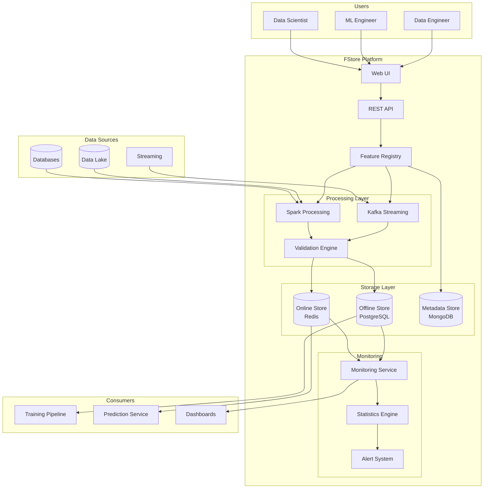
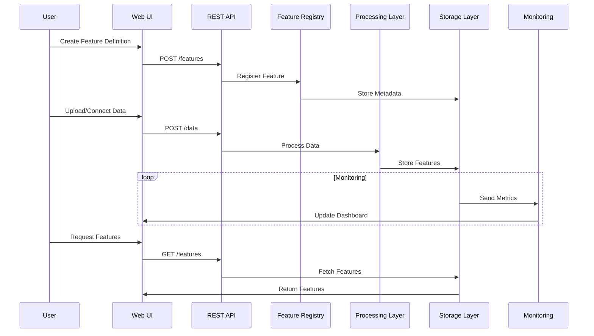
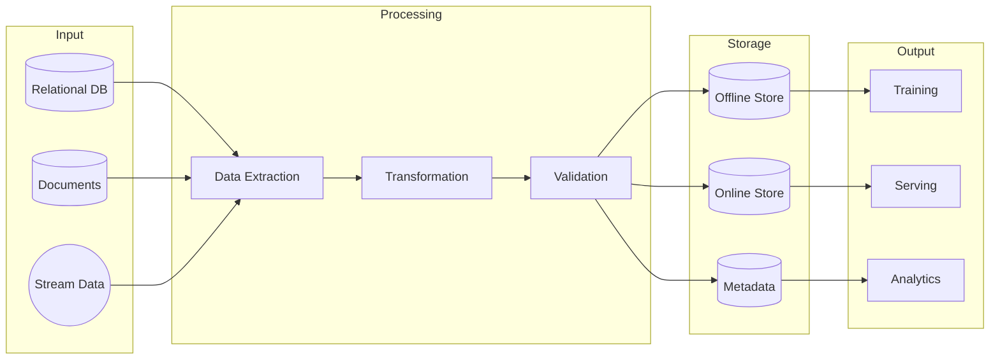

# FStore Architecture

## System Overview

## Feature Lifecycle

## Data Flow Architecture

## Component Details

### 1. Input Layer
- Multiple data source support
- Batch and streaming ingestion
- Data validation and quality checks

### 2. Processing Layer
- Feature transformation pipeline
- Real-time processing
- Batch processing
- Point-in-time correct joins

### 3. Storage Layer
- Online store for low-latency serving
- Offline store for training data
- Metadata store for feature registry

### 4. Output Layer
- Feature serving API
- Training data export
- Analytics and monitoring

### 5. Monitoring Layer
- Data quality monitoring
- Feature drift detection
- Performance metrics
- Alerts and notifications
