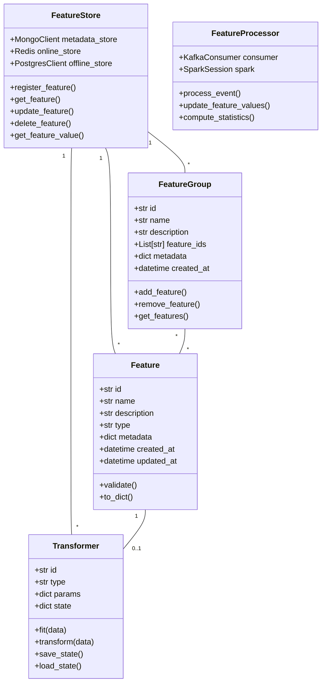
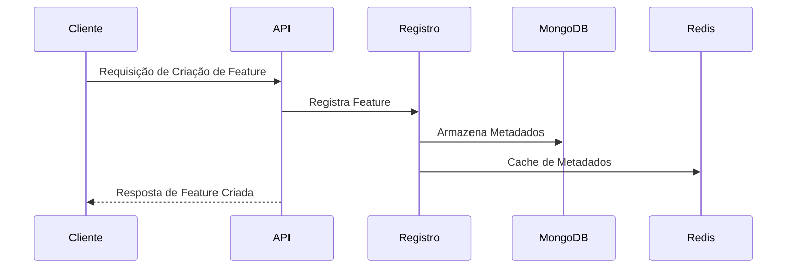
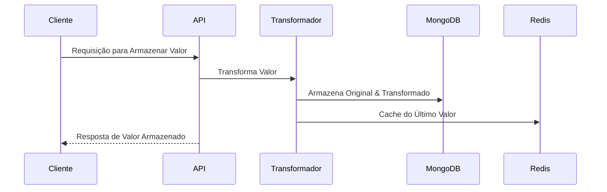
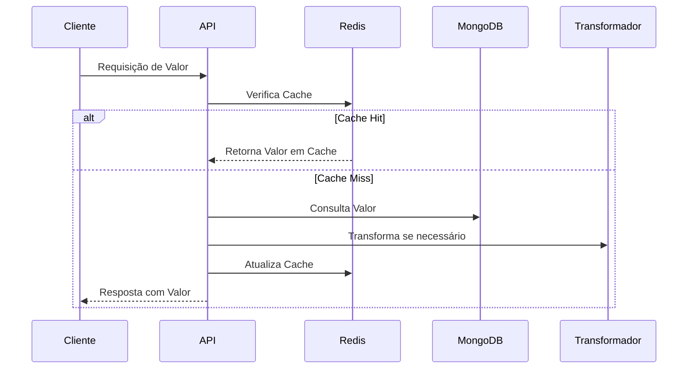
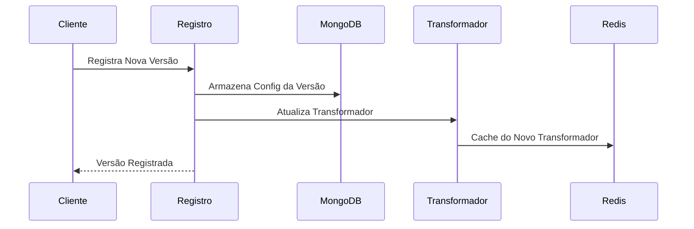

# Arquitetura da Feature Store

## Visão Geral

A Feature Store é uma plataforma moderna e escalável que suporta transformação, armazenamento e servimento de features para machine learning. A arquitetura é construída em torno dos princípios de confiabilidade, escalabilidade e facilidade de uso.

## Componentes

### 1. Serviço Backend
- **Tecnologia**: Python FastAPI
- **Propósito**: Fornece API REST para gerenciamento de features
- **Funcionalidades Principais**:
  - Operações CRUD de Features e Grupos de Features
  - Armazenamento e recuperação de valores de features
  - Integração com camada de cache
  - Tratamento de erros e validação

### 2. Processador de Features
- **Tecnologia**: Apache Spark
- **Propósito**: Processa atualizações de features em streaming
- **Funcionalidades Principais**:
  - Consumidor Kafka para atualizações em tempo real
  - Capacidades de processamento em batch
  - Validação e transformação de dados
  - Operações eficientes de escrita no PostgreSQL

### 3. Camada de Armazenamento

#### MongoDB
- Armazena metadados de features e grupos de features
- Otimizado para schema flexível e consultas em documentos
- Usado para descoberta e gerenciamento de features

#### PostgreSQL
- Armazena valores de features com schema rígido
- Otimizado para dados de séries temporais e agregações
- Suporta constraints de chave estrangeira e consultas complexas

#### Redis
- Faz cache de valores de features frequentemente acessados
- Reduz latência para servimento de features em tempo real
- Implementa invalidação de cache baseada em TTL

### 4. Fila de Mensagens
- **Tecnologia**: Apache Kafka
- **Propósito**: Gerencia atualizações de features em tempo real
- **Funcionalidades**:
  - Garante entrega confiável de mensagens
  - Suporta múltiplos consumidores
  - Mantém ordenação de mensagens

## Diagramas

### Diagrama de Classes



### Diagrama de Componentes


### Fluxo de Dados

#### 1. Criação e Registro de Features


#### 2. Transformação e Armazenamento


#### 3. Recuperação de Valores


#### 4. Gerenciamento de Versões


## Fluxo de Dados

1. **Criação de Feature**:
   ```
   Cliente -> Backend -> MongoDB & PostgreSQL
   ```

2. **Atualizações de Valores de Features**:
   ```
   Cliente -> Backend -> Kafka -> Processador de Features -> PostgreSQL
   ```

3. **Recuperação de Valores de Features**:
   ```
   Cliente -> Backend -> Redis (Cache Hit) -> Resposta
                    -> PostgreSQL (Cache Miss) -> Redis -> Resposta
   ```

## Design do Schema

### Coleções MongoDB

#### Features
```json
{
  "id": "string",
  "name": "string",
  "description": "string",
  "feature_group_id": "string",
  "type": "string",
  "entity_id": "string",
  "tags": ["string"],
  "created_at": "datetime",
  "updated_at": "datetime"
}
```

#### Grupos de Features
```json
{
  "id": "string",
  "name": "string",
  "description": "string",
  "entity_id": "string",
  "entity_type": "string",
  "tags": ["string"],
  "frequency": "string",
  "created_at": "datetime",
  "updated_at": "datetime",
  "features": ["string"]
}
```

### Tabelas PostgreSQL

#### features
```sql
CREATE TABLE features (
  id VARCHAR(255) PRIMARY KEY,
  name VARCHAR(255) NOT NULL,
  description TEXT,
  created_at TIMESTAMP WITH TIME ZONE DEFAULT CURRENT_TIMESTAMP
);
```

#### feature_values
```sql
CREATE TABLE feature_values (
  id SERIAL PRIMARY KEY,
  feature_id VARCHAR(255) REFERENCES features(id),
  entity_id VARCHAR(255) NOT NULL,
  value DOUBLE PRECISION NOT NULL,
  timestamp TIMESTAMP WITH TIME ZONE DEFAULT CURRENT_TIMESTAMP,
  UNIQUE(feature_id, entity_id)
);
```

## Otimizações de Performance

1. **Estratégia de Cache**:
   - Redis faz cache de valores de features com TTL de 1 hora
   - Cache é atualizado no momento da escrita (write-through)
   - Suporta operações de leitura de alta vazão

2. **Indexação de Banco de Dados**:
   - Índices PostgreSQL em feature_id, entity_id e timestamp
   - Índices MongoDB em feature_group_id e entity_id
   - Otimizado para padrões comuns de consulta

3. **Processamento em Batch**:
   - Processador de Features usa Spark para atualizações em batch eficientes
   - Tamanhos de batch e janelas de processamento configuráveis
   - Otimização adaptativa de consultas

## Considerações de Segurança

1. **Acesso a Dados**:
   - Autenticação e autorização na API
   - Segurança na conexão com banco de dados
   - Rate limiting nos endpoints da API

2. **Validação de Dados**:
   - Validação de entrada em todos os endpoints da API
   - Verificação de tipos e constraints
   - Tratamento de erros e logging

## Monitoramento

1. **Métricas**:
   - Latência e vazão de requisições
   - Taxas de hit/miss do cache
   - Métricas de performance do banco de dados
   - Lag do consumidor Kafka

2. **Verificações de Saúde**:
   - Monitoramento de disponibilidade dos serviços
   - Status da conexão com banco de dados
   - Status da conexão com Kafka
   - Status da conexão com Redis
