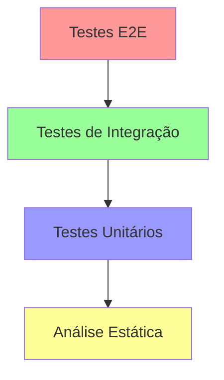

# Guia de Testes da Feature Store

Este documento descreve a estratégia de testes e como executar os diferentes tipos de testes disponíveis no projeto.

## Índice

1. [Visão Geral](#visão-geral)
2. [Configuração do Ambiente](#configuração-do-ambiente)
3. [Tipos de Testes](#tipos-de-testes)
4. [Executando os Testes](#executando-os-testes)
5. [Cobertura de Código](#cobertura-de-código)
6. [Testes de Performance](#testes-de-performance)
7. [Troubleshooting](#troubleshooting)
8. [Guia de Contribuição](#guia-de-contribuição)
9. [Métricas e KPIs](#métricas-e-kpis)
10. [Integração Contínua](#integração-contínua)

## Visão Geral

Nossa estratégia de testes é composta por várias camadas:

### Pirâmide de Testes


- **Base**: Análise estática (mypy, flake8, black)
- **Nível 1**: Testes unitários (rápidos e isolados)
- **Nível 2**: Testes de integração (componentes conectados)
- **Topo**: Testes E2E (sistema completo)

## Configuração do Ambiente

1. **Criar ambiente virtual**:
   ```bash
   python -m venv venv
   source venv/bin/activate  # Linux/Mac
   # ou
   .\venv\Scripts\activate  # Windows
   ```

2. **Instalar dependências**:
   ```bash
   pip install -r backend/requirements.txt
   ```

3. **Configurar variáveis de ambiente**:
   ```bash
   cp .env.example .env
   ```

4. **Iniciar serviços para teste**:
   ```bash
   docker compose -f docker-compose.test.yml up -d
   ```

## Tipos de Testes

### 1. Testes Unitários

Localizados em `backend/tests/unit/`

- **test_transformations.py**: Testa transformações de dados
  - Transformações numéricas
  - Transformações categóricas
  - Transformações temporais

- **test_registry.py**: Testa registro de features
  - Registro e versionamento
  - Validação de definições
  - Gestão de dependências
  - Rastreamento de linhagem

- **test_feature.py**: Testa modelos de features
  - Criação e validação
  - Atualização de metadados
  - Validação de valores

### 2. Testes de Integração

Localizados em `backend/tests/integration/`

- **test_feature_store.py**: Testa operações completas
  - Fluxo de criação de features
  - Processamento de dados
  - Armazenamento e recuperação

### 3. Testes de Segurança

Localizados em `backend/tests/security/`

- Autenticação e autorização
- Rate limiting
- Validação de entrada
- Proteção contra injeção

### 4. Testes de Performance

Localizados em `backend/tests/performance/`

- Testes de carga
- Benchmarks de operações
- Monitoramento de recursos

### 5. Testes E2E

Existem dois conjuntos de testes E2E no projeto, cada um com seu propósito específico:

#### Backend E2E (`backend/tests/e2e/`)
- **Foco**: Testa o backend de forma isolada e sua infraestrutura interna
- **Características**:
  - Testes mais abrangentes e detalhados
  - Testa múltiplos cenários (workflow completo, processamento em batch, serving)
  - Integração direta com Redis, MongoDB e Kafka
  - Inclui limpeza de dados e verificação de cache
  - Usa testes síncronos
  - Possui mecanismos de espera para serviços
  - Configuração mais complexa com conexões diretas aos serviços

#### Sistema E2E (`e2e/tests/`)
- **Foco**: Testa o fluxo completo da aplicação do ponto de vista do usuário
- **Características**:
  - Testes mais focados no fluxo principal do usuário
  - Usa testes assíncronos (pytest.mark.asyncio)
  - Mais simples e direto
  - Comunicação principalmente via API REST
  - Configuração mais simples
  - Foca em dois casos principais: fluxo completo de features e monitoramento

## Executando os Testes

### Script Automatizado

```bash
./scripts/run_tests.sh
```

### Testes Específicos

1. **Unitários**:
   ```bash
   pytest backend/tests/unit -v
   ```

2. **Integração**:
   ```bash
   pytest backend/tests/integration -v
   ```

3. **E2E**:
   ```bash
   docker compose -f docker-compose.test.yml up e2e-tests
   ```

4. **Performance**:
   ```bash
   locust -f backend/tests/locustfile.py
   ```

## Cobertura de Código

### Metas de Cobertura

| Tipo de Código | Meta Mínima |
|----------------|-------------|
| Core           | 90%         |
| API            | 85%         |
| Utils          | 80%         |

### Relatórios

```bash
pytest --cov=app --cov-report=html
```

## Testes de Performance

### Métricas Monitoradas

1. **Latência**
   - p95 < 100ms
   - p99 < 200ms

2. **Throughput**
   - > 1000 req/s para leitura
   - > 100 req/s para escrita

3. **Recursos**
   - CPU < 70%
   - Memória < 80%
   - I/O < 60%

## Troubleshooting

### Problemas Comuns

1. **Testes Falhando**
   ```bash
   pytest -v --tb=short  # stack trace reduzido
   pytest -v --pdb       # debugger interativo
   ```

2. **Problemas de Conexão**
   ```bash
   docker compose -f docker-compose.test.yml ps  # status dos serviços
   docker compose -f docker-compose.test.yml logs # logs dos serviços
   ```

## Guia de Contribuição

### Adicionando Novos Testes

1. **Estrutura**:
   ```
   tests/
   ├── unit/
   │   └── test_*.py
   ├── integration/
   │   └── test_*.py
   └── e2e/
       └── test_*.py
   ```

2. **Nomenclatura**:
   - Arquivos: `test_*.py`
   - Classes: `Test*`
   - Funções: `test_*`

3. **Fixtures**:
   - Usar `conftest.py`
   - Nomear claramente
   - Documentar propósito

## Métricas e KPIs

### Qualidade de Código

1. **Complexidade**
   - Ciclomática < 10
   - Cognitiva < 15

2. **Manutenibilidade**
   - Índice > 80%
   - Duplicação < 3%

3. **Documentação**
   - Cobertura > 90%
   - Atualidade < 30 dias

## Integração Contínua

### Pipeline

1. **Lint e Formatação**
   ```bash
   black backend/
   flake8 backend/
   mypy backend/
   ```

2. **Testes**
   ```bash
   pytest backend/tests/unit/
   pytest backend/tests/integration/
   ```

3. **Segurança**
   ```bash
   bandit -r backend/
   safety check
   ```

### Relatórios

- Cobertura: HTML e XML
- Performance: JUnit XML
- Segurança: SARIF
