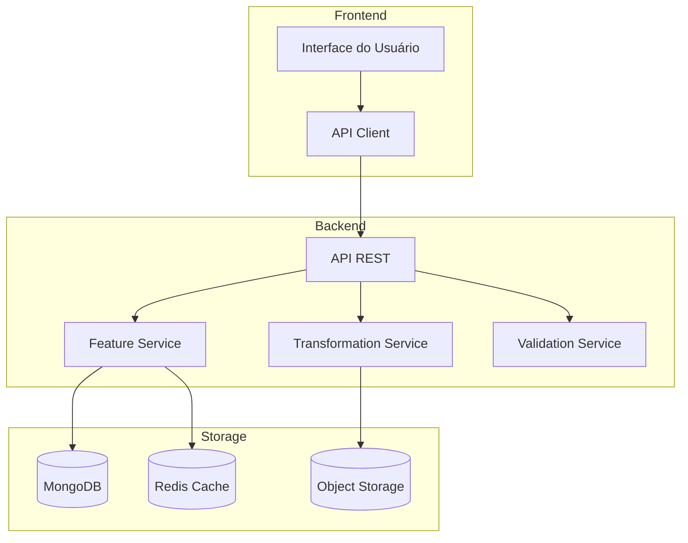
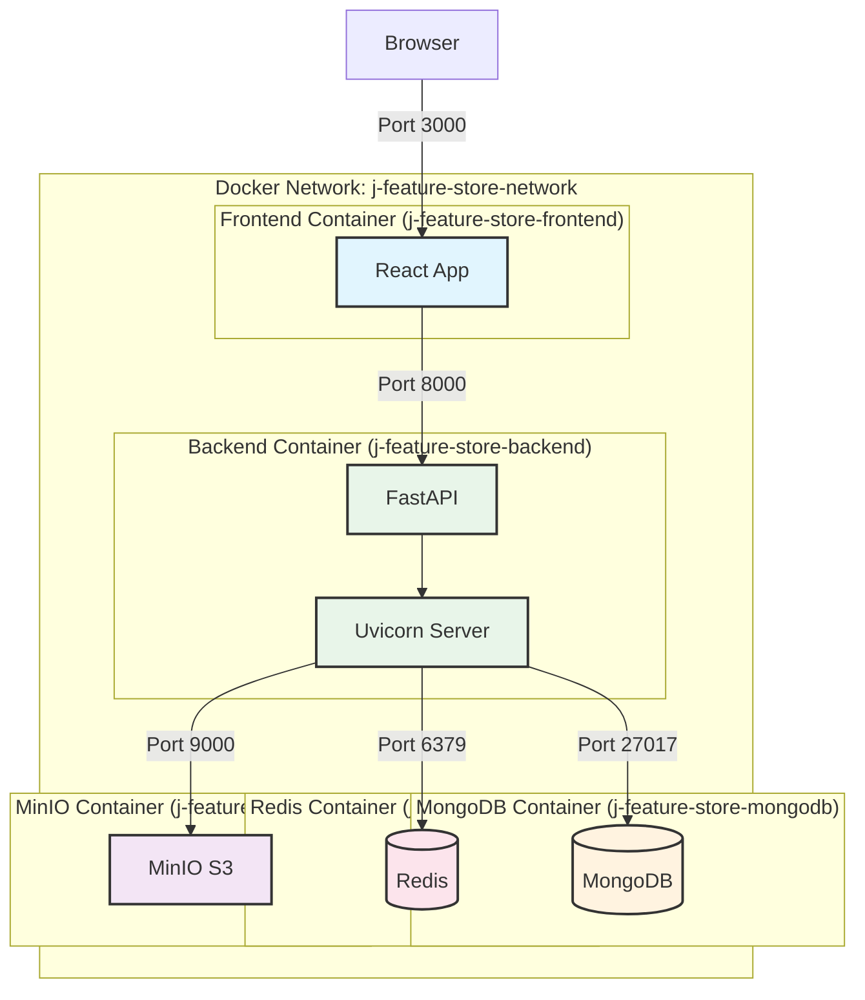

# Arquitetura do J Feature Store

## Visão Geral
O J Feature Store é uma plataforma moderna para gerenciamento de features em projetos de Machine Learning, oferecendo uma solução completa para armazenamento, versionamento e servimento de features.

## Diagramas

### Diagrama de Componentes

### Diagrama de Infraestrutura

### Detalhes dos Containers

#### Frontend Container
- **Nome**: j-feature-store-frontend
- **Porta**: 3000
- **Imagem**: node:18-alpine
- **Dependências**: Nenhuma
- **Volumes**: ./frontend:/app

#### Backend Container
- **Nome**: j-feature-store-backend
- **Porta**: 8000
- **Imagem**: python:3.11-slim
- **Dependências**: MongoDB, Redis, MinIO
- **Volumes**: ./backend:/app

#### MongoDB Container
- **Nome**: j-feature-store-mongodb
- **Porta**: 27017
- **Imagem**: mongo:6
- **Volumes**: mongodb_data:/data/db

#### Redis Container
- **Nome**: j-feature-store-redis
- **Porta**: 6379
- **Imagem**: redis:7-alpine
- **Volumes**: redis_data:/data

#### MinIO Container
- **Nome**: j-feature-store-minio
- **Portas**: 9000 (API), 9001 (Console)
- **Imagem**: minio/minio
- **Volumes**: minio_data:/data

### Rede Docker
- **Nome**: j-feature-store-network
- **Driver**: bridge
- **Subnet**: 172.20.0.0/16

### Volumes
- **mongodb_data**: Persistência do MongoDB
- **redis_data**: Persistência do Redis
- **minio_data**: Persistência do MinIO

## Comunicação entre Containers

1. **Frontend → Backend**
   - Protocol: HTTP/HTTPS
   - Porta: 8000
   - Endpoint Base: /api/v1

2. **Backend → MongoDB**
   - Protocol: MongoDB Wire Protocol
   - Porta: 27017
   - Connection String: mongodb://j-feature-store-mongodb:27017

3. **Backend → Redis**
   - Protocol: Redis Protocol
   - Porta: 6379
   - Connection String: redis://j-feature-store-redis:6379

4. **Backend → MinIO**
   - Protocol: HTTP/HTTPS
   - Porta: 9000
   - Endpoint: http://j-feature-store-minio:9000

## Configuração de Alta Disponibilidade

### Frontend
- Múltiplas réplicas atrás de um load balancer
- Cache de assets estáticos via CDN

### Backend
- Múltiplas réplicas do FastAPI
- Load balancing via Nginx/Traefik
- Health checks para auto-recuperação

### Databases
- MongoDB: Replica Set com 3 nós
- Redis: Cluster mode com sentinels
- MinIO: Distributed mode com múltiplos nós
